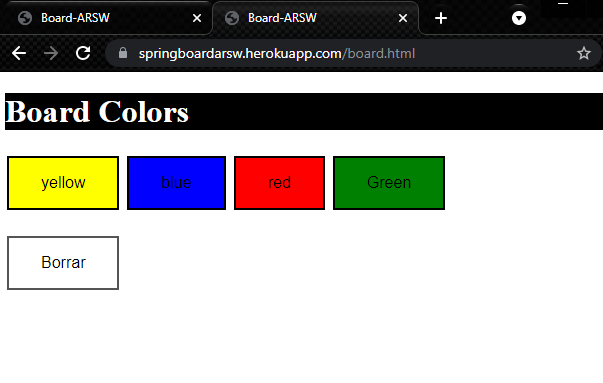
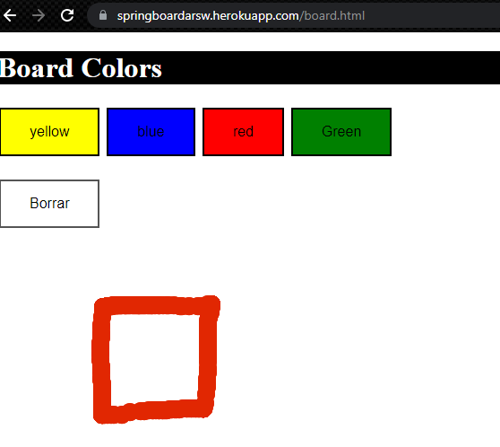
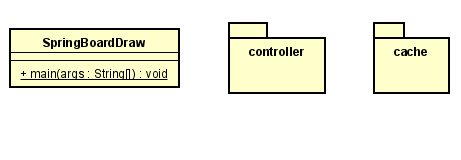
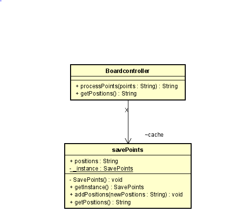
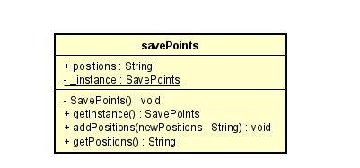

# Board

### Daniel Santiago Ducuara Ardila
### 28/06/2021

## Resumen
Este repositorio consiste en la elaboración de un tablero interactivo, es decir que lo que dibuje una persona
debe aparecer en el tablero de los demás, el tablero contiene opciones como cambiar de color y borrar todo
el tablero.

## Ejecución localmente 
Para la ejecución local se debe ejecutar la clase SpringBoardDraw y en el navegador colocar lo siguiente http://localhost:8080/board.html

## Ejecución en Heroku

El tablero está desplegado en heroku, el color por defecto para dibujar es negro, se puede cambiar de color seleccionando el color.
 
Se comienza a dibujar en el tablero.
 
Posteriormente el dibujo realizado debe aparecer en otra ventana.
 
Al seleccionar el botón borrar se borra lo realizado en el tablero.
 

## Diagrama de clases

### Paquete Board
 
El paquete board consta de la clase SpringBoardDraw que ejecuta la aplicación spring boot, la clase consta de dos
subpaquetes, el controlador de spring boot y cache que es una clase encargada de almacenar los puntos enviados por
el usuario.

### Paquete Controller
 
El paquete Controller consta de la clase BoardController que contiene un objeto savePoints el cual guardará los puntos dibujados por el usuario,
el controlador contiene dos métodos, processPoints recibe como parámetro una cadena que contiene los puntos dibujador por el usuario y los envía
a savePoints y contiene el método getPositions para obtener de nuevo la cadena con los puntos.

### Paquete Cache
 
El paquete  cache contiene la clase savePoints que se encarga de almacenar y retornar la cadena de puntos dibujador por los usuarios.

## Reporte de pruebas
Se realiza el reporte de pruebas con todas las pruebas satisfactorias.
- Se realizan dos pruebas en la que se envían cadenas a la clase savePoints y se verifica que retorne los puntos correctamente.
   

### Productividad
La productividad de este proyecto fue de 250LOC/5 horas .
